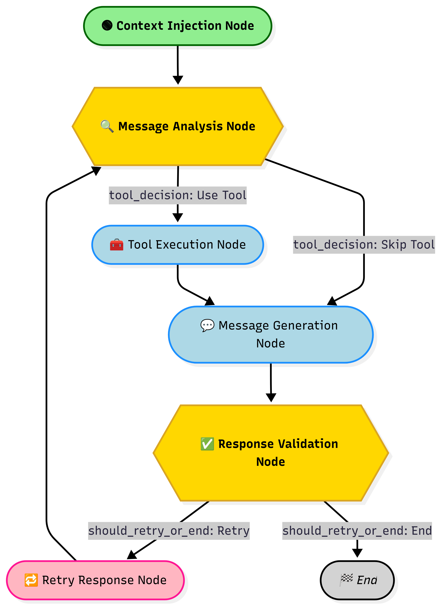

# ⚽ FPL Gaffer

> Your AI-powered Fantasy Premier League co-manager that provides data-driven insights, transfer suggestions, and tactical advice.

[](https://www.python.org/downloads/)
[]()
[](https://opensource.org/licenses/MIT)

## 📖 Overview

**FPL Gaffer** is an intelligent agentic AI system designed to assist Fantasy Premier League (FPL) managers with informed decision-making. Built using LangGraph, it combines real-time data retrieval, intelligent tool orchestration, and response validation to provide accurate, hallucination-free advice for your FPL team.

Unlike generic chatbots, FPL Gaffer:
- 🎯 **Never hallucinates** - Every suggestion is backed by real data
- 🔄 **Self-validates** - Automatically checks responses for accuracy before sending
- 🧠 **Learns from mistakes** - Validation feedback loops back to gather missing data
- 💬 **Speaks FPL** - Uses community language and understands the game deeply
- 📱 **WhatsApp-ready** - Conversational, plain-text responses perfect for mobile

## 🌟 Key Features

### Intelligent Agent Architecture
- **Context-Aware Processing**: Automatically injects user context (team value, budget, rank) into every interaction
- **Smart Tool Selection**: LLM-powered analysis determines which data sources to query
- **Multi-Tool Orchestration**: Seamlessly combines multiple data sources for comprehensive answers
- **Validation Loop**: Self-corrects by detecting hallucinations and gathering missing data
- **Conversation Memory**: MySQL checkpointer maintains conversation history for contextual responses

### FPL-Specific Capabilities
- 📊 **Team Analysis**: Detailed insights into your current squad, transfers, and finances
- 🔍 **Player Research**: Stats, form, injuries, and pricing for informed transfers
- 📅 **Fixture Analysis**: Upcoming schedule planning for captain picks and transfers
- 💰 **Budget Planning**: Smart suggestions within your exact financial constraints
- 📰 **News Integration**: Real-time injury updates, press conferences, and expert opinions
- 🎲 **Transfer Suggestions**: Position-based player recommendations with filters

## 🏗️ Architecture

### Workflow Graph



### Key Components

#### 1. **State Management** (`state.py`)
```python
class WorkflowState(MessagesState):
    """State for the FPL Gaffer workflow."""

    # User & gameweek context
    user_id: int
    user_data: Dict[str, Any]
    gameweek_data: Dict

    # Tool execution
    tool_calls: List[Dict[str, Any]]
    tool_results: Dict[str, Any]

    # Response generation
    response: str

    # Validation and control flow
    is_retry: bool
    retry_count: int
    validation_passed: bool
    validation_errors: List[str]
    validation_suggestions: List[str]
```

#### 2. **Intelligent Tool Selection**
The tool selection node uses LLM reasoning to determine which tools are needed:
- **Initial requests**: Analyzes user query directly
- **Retry requests**: Processes validation feedback to gather missing data

```python
# Example validation feedback loop:
Validation: "Response mentions 'good fixtures' but no fixture data retrieved"
         ↓
Retry Tool Selection: Calls get_fixtures_for_range_tool()
         ↓
New Response: Based on actual fixture data
```

#### 3. **Validation System**
Prevents hallucinations by checking:
- ✅ All player suggestions exist in tool results
- ✅ Price recommendations match user budget
- ✅ Fixture claims backed by actual data
- ✅ Statistics match retrieved information
- ✅ All user questions addressed with real data

## 🛠️ Available Tools

| Tool | Description | Use Case |
|------|-------------|----------|
| `news_search_tool` | Search FPL news, injuries, press conferences | Player news, expert opinions, updates |
| `get_user_team_info_tool` | Retrieve user's squad, transfers, finances | Team analysis, budget planning |
| `get_players_by_position_tool` | Filter players by position & max price | Transfer targets, squad building |
| `get_player_data_tool` | Get detailed player stats, form, injuries | Player comparison, transfer decisions |
| `get_fixtures_for_range_tool` | Get upcoming fixtures for X gameweeks | Captain picks, fixture planning |


## 🎮 Example Interactions

### Transfer Advice
```
User: "I have £1.5m in the bank. Any good midfielders I should look at?"

FPL Gaffer: "Nice budget to work with! Let me check the mid-priced midfielders 
for you... Palmer (£6.8m) is looking cracking right now - 3 goals in last 4 games 
and Chelsea's fixtures are solid. Saka (£9.0m) is another shout if you can stretch 
the budget a bit. Both on penalties too which is a bonus!"
```

### Fixture Analysis
```
User: "What are the fixtures like for the next 3 gameweeks?"

FPL Gaffer: "Right, let's look ahead...GW10-12 is massive for City assets - they've 
got Bournemouth (H), Brighton (A), and Spurs (H). Haaland differential could be 
huge here. Arsenal have a mixed bag with Liverpool (A) sandwiched between two 
decent fixtures. Villa's got the best run though - all green on the ticker!"
```

### Team Analysis
```
User: "How's my team looking?"

FPL Gaffer: "Your team's solid mate! Sitting at £102.5m value with £0.5m ITB. 
You've got the template sorted with Salah and Haaland up top. Defense might need 
a look though - you've got three players with tough fixtures coming up. Fancy 
making a move there?"
```

## 🏆 Why FPL Gaffer?

### Technical Excellence
- **Agentic AI Design**: Not just a chatbot - FPL Gaffer reasons about what data it needs
- **Self-Healing Responses**: Validation loops ensure accuracy before delivery
- **Modular Architecture**: Clean separation of concerns for easy maintenance
- **Production-Ready**: MySQL persistence, error handling, retry logic

### FPL-Specific Intelligence
- **Domain Expertise**: Understands FPL strategy, not just player stats
- **Community Language**: Speaks like an FPL veteran
- **Budget-Aware**: Never suggests transfers you can't afford
- **Fixture-Conscious**: Considers short and long-term planning

### Real-World Impact
- **No Hallucinations**: Only suggests players and strategies backed by data
- **Conversational**: Feels like chatting with your FPL-obsessed mate
- **Mobile-First**: Designed for WhatsApp, perfect for deadline decisions
- **Memory**: Remembers your previous conversations and team decisions

## 📄 License

This project is licensed under the MIT License - see the [LICENSE](LICENSE) file for details.

## 👨‍💻 Author

**DejusDevspace**
- GitHub: [@DejusDevsapce](https://github.com/DejusDevspace)
- LinkedIn: [Ojomideju Adejo](https://linkedin.com/in/deju-adejo)
- Twitter: [@d3ju.ai](https://x.com/adejo_deju)

## 🙏 Acknowledgments

- [LangGraph](https://github.com/langchain-ai/langgraph) for the agent framework
- [Fantasy Premier League API](https://fantasy.premierleague.com) for FPL data
- The FPL community for inspiration and insights

---

<div align="center">

**⚽ Built with passion for FPL managers ⚽**

If you find this project helpful, please consider giving it a ⭐!

</div>
